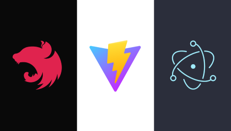

<p align="center">
    
</p>

# ⚡Vite + Electron + Nestjs Template

This template is used to build [vite](https://vitejs.dev/) + [electron](https://www.electronjs.org/) + [nestjs](https://nestjs.com/) projects. Build with [Doubleshot](https://github.com/Doubleshotjs/doubleshot), crazy fast!

🎉 [Doubleshot](https://github.com/Doubleshotjs/doubleshot) is a whole new set of tools to help you quickly build and start a node backend or electron main process.

## Introduce
This is a template based on my repo: [fast-vite-electron](https://github.com/ArcherGu/fast-vite-electron). In the main process, I integrated nestjs. In the main process, you can build your code just as you would write a nestjs backend. Desktop clients built from this template can quickly split the electron when you need to switch to B/S.

## Features

- 🔨 [vite-plugin-doubleshot](https://github.com/archergu/doubleshot/tree/main/packages/plugin-vite#readme) to run/build electron main process or node backend.
<br>

- 🛻 An electron ipc transport for [nestjs](https://nestjs.com/) that provides simple ipc communication.
<br>

- 🪟 An electron module for [nestjs](https://nestjs.com/) to launch electron windows.
<br>

- ⏩ Quick start and build, powered by [tsup](https://tsup.egoist.sh/) and [electron-builder](https://www.electron.build/) integrated in [@doubleshot/builder](https://github.com/Doubleshotjs/doubleshot/tree/main/packages/builder)

## How to use

- Click the [Use this template](https://github.com/ArcherGu/fast-vite-electron/generate) button (you must be logged in) or just clone this repo.
- In the project folder: 
  ```bash
  # install dependencies
  yarn # npm install

  # run in developer mode
  yarn dev # npm run dev

  # build
  yarn build # npm run build
  ```

## Note for PNPM

In order to use with `pnpm`, you'll need to adjust your `.npmrc` to use any one the following approaches in order for your dependencies to be bundled correctly (ref: [#6389](https://github.com/electron-userland/electron-builder/issues/6289#issuecomment-1042620422)):
```
node-linker=hoisted
```
```
public-hoist-pattern=*
```
```
shamefully-hoist=true
```

## Relative

My blog post:

- [极速 DX Vite + Electron + esbuild](https://archergu.me/posts/vite-electron-esbuild)
- [用装饰器给 Electron 提供一个基础 API 框架](https://archergu.me/posts/electron-decorators)